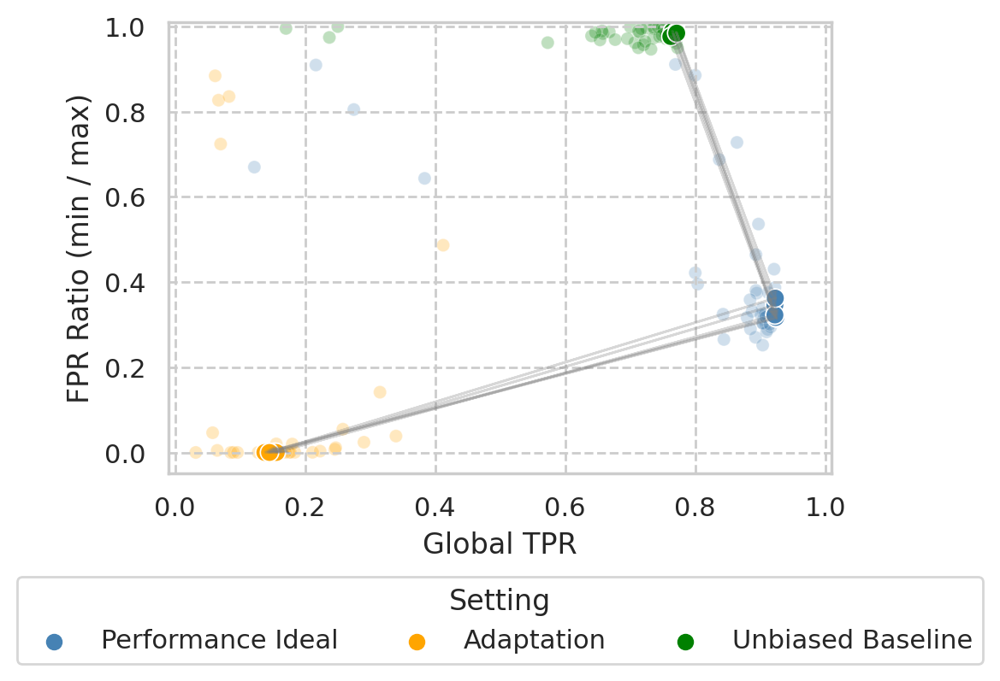

# A Data-Centric Study on Unfairness in Fraud Detection

This is the repository for the KDD 2023 Applied Data Science Track submission _"A Data-Centric Study on Unfairness in Fraud Detection"_.

This repository contains:
- Code and data to reproduce the plots shown in the results section of the paper.
- Code on how to reproduce the paper's experiments on a realistic, publicly-available, state-of-the-art bank account fraud dataset suite.

## Key Contributions

- A formal taxonomy to characterize data bias between a protected attribute, other features, and the target variable.
- Experimental results for a comprehensive suite of scenarios regarding fairness-accuracy trade-offs ML models make under distinct types of data bias, pertinent, but not restricted to, fraud detection.
- Demonstrating how models can shape data bias, and consequently unfairness, in dynamic environments.
- Showing how, by changing data bias settings, the picture of algorithmic fairness changes, and how comparisons among algorithms differ.
- Raising awareness to the issue of variance in fairness measurements, underlining the importance of employing robust models and metrics.
- Evaluation of the utility of simple unfairness mitigation methods under distinct data bias conditions.

## Plot Reproducibility

- [paper_plots.ipynb](notebooks/paper_plots.ipynb) contains code to reproduce each plot in the results section of the paper. 
- [results_data/](results_data/) folder contains the trained models' evaluation results for each experiment, which are used to create the plots.

## Running experiments on a public dataset.

- The notebook [baf_experiments.ipynb](notebooks/baf_reproduction.ipynb) contains code to reproduce the experiments of the paper on [Bank Account Fraud (BAF)](https://www.kaggle.com/datasets/sgpjesus/bank-account-fraud-dataset-neurips-2022), a publicly-available bank account fraud dataset suite (the most similar to the one we used).
    - This suite contains a total of 6 realistic fraud datasets (one base dataset, and 5 variants), in which each dataset has a type of data bias, such that they can be used to reproduce some of the experiments conducted in our paper.
    - For example, the following correspondence can be made between the suite's dataset and the data bias Scenarios we analyzed in the paper:
        - Base dataset for the baseline
        - Variant I for Scenario 1
        - Variant II for Scenario 2
        - Variant III for Scenario 3
        - Variant V for Scenario 5
    
    Reproducibility for Scenarios 4 and 6 are a work in progress.

This code considers the hyperparameter configurations used in the paper's experiments (sampled from the grids in folder hyperparameter_spaces).

We are unable to provide further information on the original data due to privacy concerns.

## Citing
WIP.
